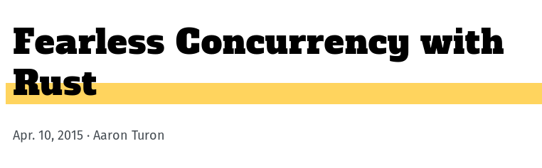
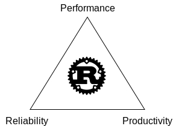
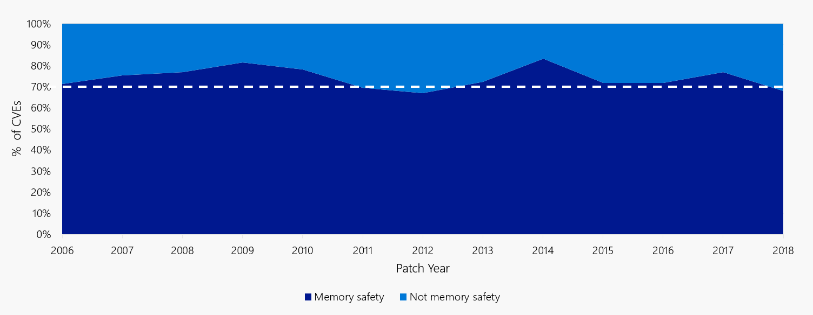
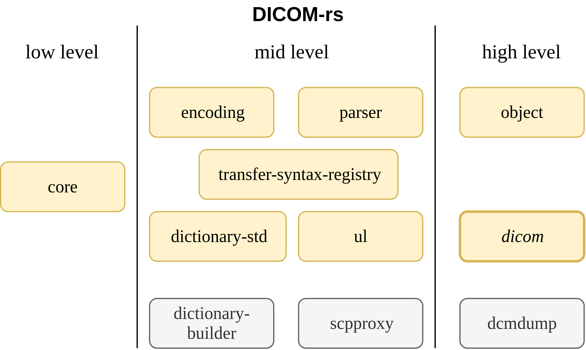
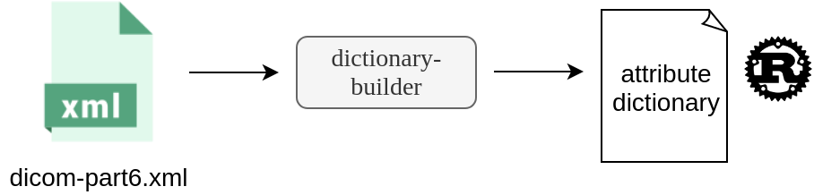
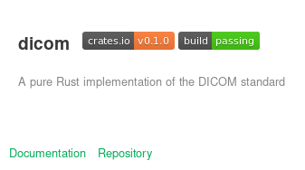
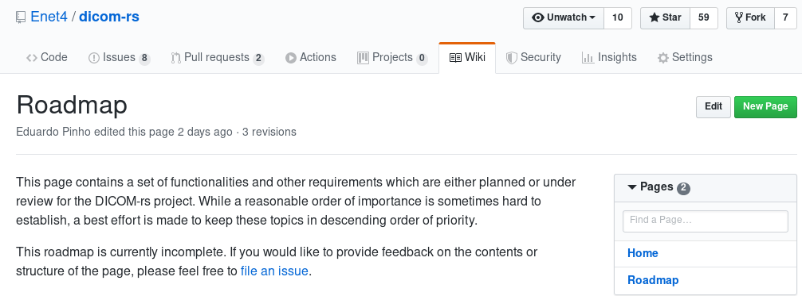

# Medical Imaging Informatics meets Rust

> An introduction to the Rust programming language and the DICOM-rs project

<div style="font-size: 24pt; text-align: left; margin-top: 96px; margin-bottom: 24px;">Eduardo Pinho</div>
<br>

<div style="font-size: 14pt; text-align: right; margin: 0.5cm;">8th November 2019</div>

---

## Medical Imaging Informatics


<div class="container">
<ul>
  <li>Plays an important role</li>
  <li>Evolving quickly</li>
  <li>Increasing requirements</li>
  <ul>
    <li>More data, larger studies</li>
    <li>Demands for fast visualization & better decision support</li>
  </ul>
  <li class="fragment" data-fragment-index="0">Dependent on the DICOM standard</li>
  <ul>
    <li class="fragment" data-fragment-index="0">Value in good implementations</li>
    <li class="fragment" data-fragment-index="1"><b>DICOM-rs</b>: an implementation in Rust</li>
  </ul>
<ul>
</div>

.

# What is Rust?


- Multi-paradigm programming language
- Started by Graydon Hoare, intern at Mozilla
  - Later on deferred to specialized teams
- 1.0.0 released in May 2015
  - New release every 6 weeks (current: 1.39.0)



.



.

## Performance

- Compiled (LLVM)
- Minimal runtime
- Predictive, no garbage collector
- Abstraction without overhead

```rust
let new_services: BTreeMap<_, _> = services.into_iter()
   .filter(|(name, _)| name.ends_with("_1"))
   .collect();
```

.

#### So I heard you like Python.

```python
def is_blank(s):
    return not s or s.isspace()
```

<span class="fragment" data-fragment-index="0">Objective: Count blank lines of a file.</span>

<span class="fragment" data-fragment-index="1">400MB text file</span>

<span class="fragment" data-fragment-index="2">Real time (wall clock): 2.05 s</span>

<span class="fragment" data-fragment-index="2">👎</span>

.

#### Or maybe you like C++?

```c++
#include <string>
#include "utf8.h"

bool is_blank(const std::string& line) {
    auto it = line.begin();
    auto end = line.end();
    while (it != end) {
        auto c = utf8::next(it, end);
        if (!std::iswspace(c)) return false;
    }
    return true;
}
```

<span class="fragment" data-fragment-index="0">Faster: 0.80 s</span>

<span class="fragment" data-fragment-index="1">Without string checking (<code>utf8::is_valid</code>): 0.26 s</span>

<span class="fragment" data-fragment-index="2">But more unwieldy: more lines, uses 3rd party lib</span>

<span class="fragment" data-fragment-index="2">🙍</span>

.

#### With Rust...

```rs
fn is_blank(s: &str) -> bool {
    s.chars().all(|c| c.is_whitespace())
}
```

Nice one-liner

Fast (0.46s)

UTF-8 checked, safe to use


Note: If you'd like the original source codes of this microbenchmark, please let me know.

.

## Reliability

The risks of C and C++:

<ul>
<li>use after free</li>
<li>double pointer</li>
<li>memory leaks</li>
<li>buffer overreads</li>
<li>data races</li>
<li class="fragment" data-fragment-index="0">A single breach is dangerous</li>
</ul>

<div class="fragment" data-fragment-index="0">😰</div>

.



~70% of the vulnerabilities Microsoft assigns a CVE each year continue to be memory safety issues

<small><a>https://msrc-blog.microsoft.com/2019/07/16/a-proactive-approach-to-more-secure-code/</a></small>

.

### Memory safety without garbage collector

<div class="container">
<div class="column column-one">
<ul>
<li>Ownership & borrowing mechanism</li>
<ul>
  <li>Restricted aliasing</li>
  <li>Moving, Copying, Borrowing</li>
  <li>Lifetime-aware type system</li>
</ul>
<li class="fragment" data-fragment-index="0">No null references</li>
<ul class="fragment" data-fragment-index="0">
  <li>Sum types (<code>Option</code>, <code>Result</code>, etc.)</li>
  <li>Pattern matching</li>
  <li>Error handling facilities (<code>?</code> operator)</li>
</ul>
<li class="fragment" data-fragment-index="1">Prevent memory conflicts</li>
</div>
<div class="column column-two">

</div>
</div>

.


<small>https://rufflewind.com/img/rust-move-copy-borrow.png</small>

.

### Concurrency

- Restricted aliasing prevents data races.

```rust
use rayon::prelude::*;

fn mandelbrot() -> Vec<u32> {
    (-10..=10).flat_map(|i| (-20..=5).map(move |j| (i, j)))
        .par_iter() // <-- parallel computation
        .map(|(re, im)| mandel(Complex64::new(rs as f64, im as f64)))
        .collect()
}
```
<!-- .element: class="fragment" data-fragment-index="0" --> 

.

## Productivity

- Powerful type system
   - Generics, traits, macros (`derive`)
- <!-- .element: class="fragment" data-fragment-index="0" -->  Official package manager: <b>Cargo</b> 
   - Run application: `cargo run`
   - Run tests: `cargo test`
- <!-- .element: class="fragment" data-fragment-index="1" --> Public registry: <a href="https://crates.io">crates.io</a>
   - &gt; 31k crates
- <!-- .element: class="fragment" data-fragment-index="2" -->  Stability concerns
   - Edition mechanism (Rust 2018)
   - No Rust 2.0
- <!-- .element: class="fragment" data-fragment-index="3" --> Good community values
   - Various places and initiatives to help learners.

Note: Rust has a strong history of striving to provide safe spaces. The code of conduct was there from day 1, for example.

.

### Who is using Rust?

- Amazon: Firecracker microVM
- Google: Fuchsia project
- Facebook: Libra (Blockchain)
- Mozilla: Firefox Quantum
- npm: package registry backend

.

### What Rust gives <b>you</b>

<div class="container">
<div class="column column-one">
 

🤔 

<ul>
<li>👍 Productivity and tooling <!-- .element: class="fragment" data-fragment-index="0" --> </li>
<li>💪 Systems programming <!-- .element: class="fragment" data-fragment-index="1" --> </li>
<li>💪 Boost webapps with WebAssembly <!-- .element: class="fragment" data-fragment-index="1" --> </li> 
</ul>

</div>
<div class="column column-two">


🤔

<ul>
<li>👍 Minimal runtime, zero-cost abstractions <!-- .element: class="fragment" data-fragment-index="2" --></li>
<li>💪 Protection from memory unsafety <!-- .element: class="fragment" data-fragment-index="3" --> </li>
<li>💪 Standard tooling <!-- .element: class="fragment" data-fragment-index="3" --> </li>
</ul>

</div>
</div>

---

# DICOM-rs

Implementation in pure Rust. <!-- .element: class="fragment" data-fragment-index="0" --> 

- Just giving it a try ...  <!-- .element: class="fragment" data-fragment-index="1" --> 
   - Became more ambitious.  <!-- .element: class="fragment" data-fragment-index="1" --> 
- Idiomatic Rust  <!-- .element: class="fragment" data-fragment-index="2" --> 
- Started in late 2016 (!!) <!-- .element: class="fragment" data-fragment-index="3" --> 

.

```rust
use dicom::object::open_file;

let obj = open_file("0001.dcm")?;
// fetch by alias
let patient_name = obj.element_by_name("PatientName")?.to_str()?;
let modality = obj.element_by_name("Modality")?.to_str()?;
// or by tag
let e = obj.element(Tag(0x0002, 0x0002))?;
```

.



.

## Curiosities

Note: Now here are a few interesting things about the library

.

### Code generation: `dictionary-std`

 


```rust
//! Automatically generated.

/// CommandGroupLength (0000,0000) UL 1 DICOM
pub const COMMAND_GROUP_LENGTH: Tag = Tag(0x0000, 0x0000);
/// AffectedSOPClassUID (0000,0002) UI 1 DICOM
pub const AFFECTED_SOP_CLASS_UID: Tag = Tag(0x0000, 0x0002);
/// RequestedSOPClassUID (0000,0003) UI 1 DICOM
pub const REQUESTED_SOP_CLASS_UID: Tag = Tag(0x0000, 0x0003);
```
<!-- .element: class="fragment" data-fragment-index="0" --> 

"dicom-dictionary-std/src/entries.rs" is auto-generated.
<!-- .element: class="fragment" data-fragment-index="1" --> 

.

### Compile-time plugins
 
- Extend <em>transfer syntax</em> support
- <code>inventory</code> crate

```rs
// install private transfer syntax
submit_transfer_syntax! {
    TransferSyntax::new(
        "1.2.840.10008.9999.9999",
        "Dummy Explicit VR Little Endian",
        Endianness::Little, // little endian
        true,               // explicit value representation
        Codec::Dataset(DummyCodecAdapter),
    )
}
```

.

### WebAssembly ready! 🎉

- No bindings to native libraries
- It's already being used on web projects
- Wasm testing in CI may happen eventually

.

### Growing the project

<div></div>

<ul>
<li><code>0.1.0</code> released in 1st September 2019</li>
<li>60+ stars on GitHub</li>
</ul>



---

# Conclusion

<span class="fragment" data-fragment-index="0">Want to learn Rust? → https://www.rust-lang.org ←</span>

<span class="fragment" data-fragment-index="1">Contribute to DICOM-rs:  https://github.com/Enet4/dicom-rs</span>

.

<h3 style="margin-top: 2cm">Thank you!</h3>


<div class="foot" style="font-size: 18pt; margin-top: 2.5cm; margin-left: 0pt; margin-right: 0pt; margin-bottom: 0pt;">
  <a href="https://github.com/Enet4"> Enet4</a>
  &nbsp;
  <a href="https://www.twitter.com/E_net4">@E_net4</a>
</div>

Note: This concludes my presentation. You may find me on Twitter or GitHub. Thank you!

